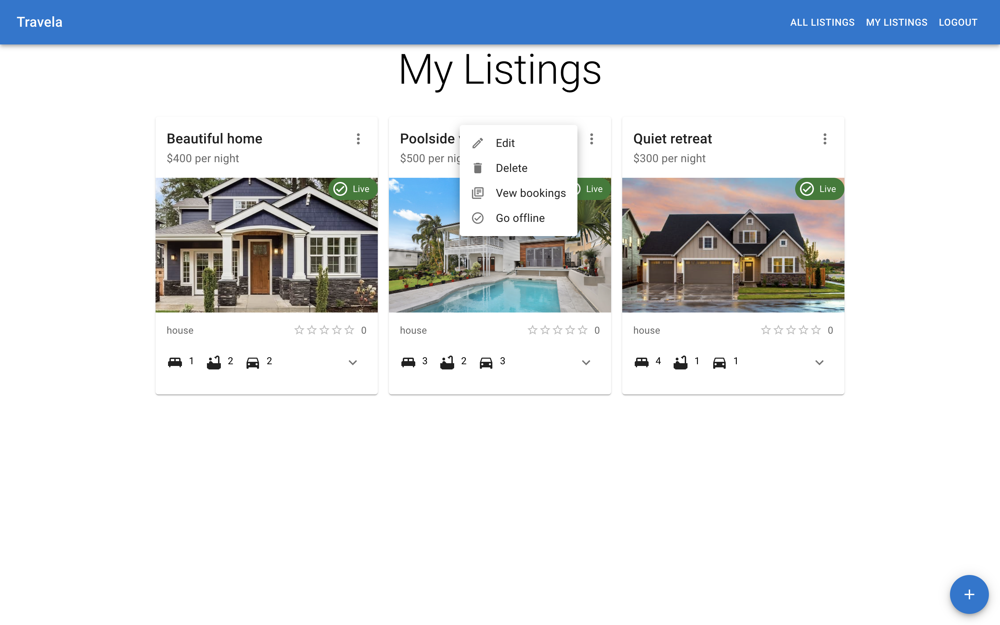
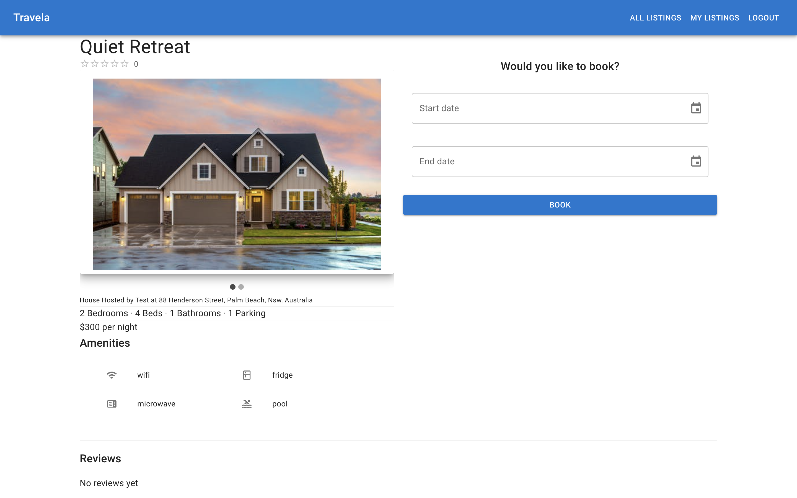
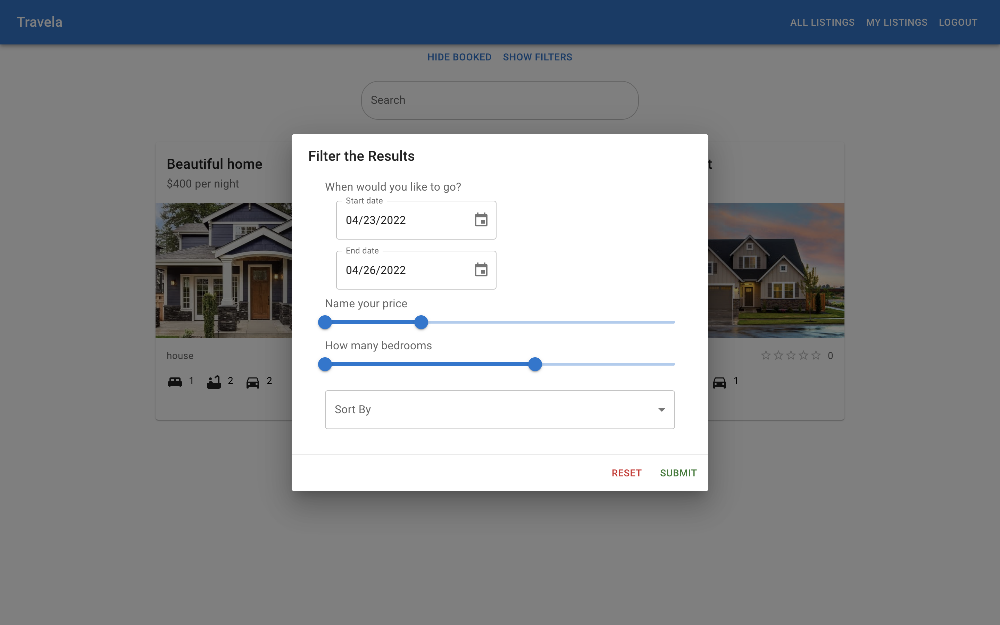
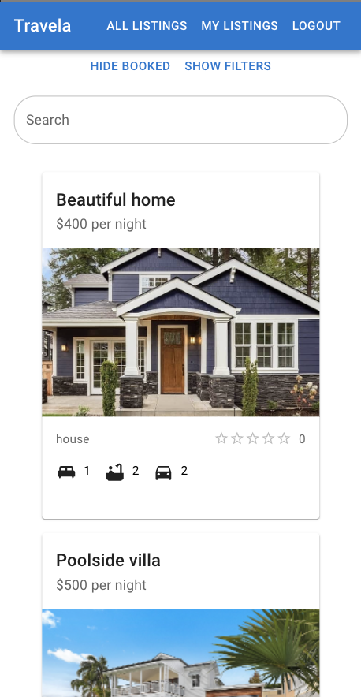
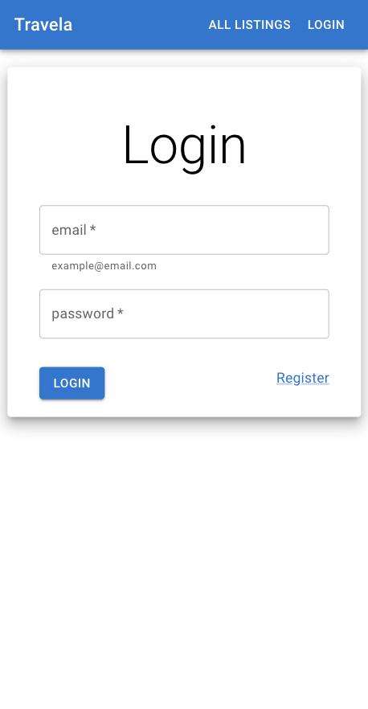

<div align="center" id="top">
  <h1>Travela Client</h1>
  <a href="https://travela-app.netlify.app/">Click here for demo</a>
</div>
  &#xa0;

<p align="center">
  <a href="#dart-about">About</a> &#xa0; | &#xa0;
  <a href="#sparkles-features">Features</a> &#xa0; | &#xa0;
  <a href="#rocket-technologies">Technologies</a> &#xa0; | &#xa0;
  <a href="#white_check_mark-requirements">Requirements</a> &#xa0; | &#xa0;
  <a href="#checkered_flag-starting-out">Starting Out</a> &#xa0; | &#xa0;
  <a href="#camera-screenshots">Screenshots</a> &#xa0; | &#xa0;
  <a href="#memo-license">License</a> &#xa0; | &#xa0;
  <a href="https://github.com/nicolunardi" target="_blank">Author</a>
</p>

<br>

## :dart: About ##

Travela is an AirBnB like app built with React and Material UI for the frontend, and a backend of FastApi, a python framework using a postgreSQL database.

The app allows users to create and manage listings as well as the bookings for each listing. Users can also search for available listings and filter or sort them.

I was motivated to build this project in order to solidify my understanding of React, as well as to try a different backend framework to Express.js. I chose FastApi as I required a fast, lightweight solution, as well as for a way to build on my python experience.

The Backend of the project can be found at [Travela server](https://github.com/nicolunardi/travela-server)

## :sparkles: Features ##

[:white_check_mark:] Auth functions;\
[:white_check_mark:] Creating, editing, and deleting listings;\
[:white_check_mark:] Searching, sorting, and filtering listings;\
[:white_check_mark:] Making and managing bookings;\
[:white_check_mark:] Listing owners can see stats of their listings;\
[:white_check_mark:] Review listings;\
[:x:] Searching listings on map and show listings on map;\
[:x:] Display charts of listing stats for owners;

## :rocket: Technologies ##

The following tools were used in the frontend of this project:

- React.js
- Material UI v5

For the backend checkout [Travela Server](https://github.com/nicolunardi/travela-server)

## :white_check_mark: Requirements ##

Before starting you need to have Node installed

## :checkered_flag: Starting Out ##

```bash
# Clone this project
$ git clone https://github.com/nicolunardi/travela-client

# Install dependencies
$ npm install

# Run the project
$ npm run start

# The server will initialize in the <http://localhost:3000>
```

## :camera: Screenshots ##







## :memo: License ##

This project is under license from MIT

Made with :heart: by <a href="https://github.com/nicolunardi" target="_blank">Nico Lunardi</a>

&#xa0;

<a href="#top">Back to top</a>
